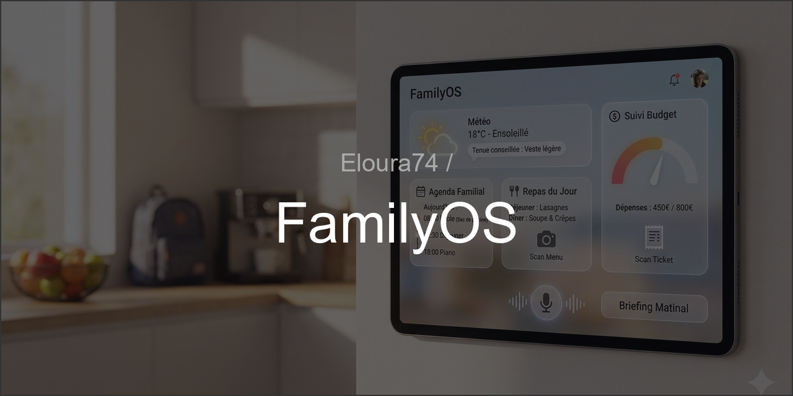

<div align="center">
  
</div>
<br>

# 🏠 FamilyOS

FamilyOS est un tableau de bord familial intelligent et centralisé, conçu pour simplifier la gestion quotidienne du foyer. Il regroupe météo, agenda, menus, budget et bien plus, le tout propulsé par une IA locale et cloud.


## ✨ Fonctionnalités Principales

### 🌤️ Météo & Recommandations

- **Météo en temps réel** : Affichage ultra-clean de la température et des conditions (OpenMeteo).
- **Conseils Vestimentaires** : "Tenue conseillée" générée dynamiquement selon la météo (ex: "Il fait froid, sortez couverts !").

### 📅 Agenda Familial Intelligent

- **Synchronisation Google Calendar** : Vue unifiée des événements de toute la famille.
- **Timeline Intuitive** : Affichage chronologique des événements à venir (Aujourd'hui, Demain...).
- **Tags & Sacs d'Activités** : L'IA détecte les activités (ex: "Piscine") et rappelle les affaires à prendre (ex: "N'oublie pas le maillot !").

### 🍽️ Gestion des Repas (IA)

- **Menu du Jour** : Affichage clair du déjeuner et du dîner.
- **Scan de Menu** : Prenez en photo le menu de la cantine ou votre planning hebdo, l'IA (Gemini Vision) l'analyse et remplit le calendrier automatiquement.
- **Planning Hebdomadaire** : Vue globale des repas de la semaine.

### 💸 Suivi Budget (IA)

- **Scan de Tickets** : Prenez en photo un ticket de caisse, l'IA extrait le montant, le commerçant et la catégorie.
- **Suivi Mensuel** : Jauge de dépenses en temps réel par rapport à un objectif défini.

### 🤖 Assistant Vocal & Briefing

- **Briefing Matinal** : Un résumé audio (TTS) de votre journée (Météo + Agenda + Menu) pour bien démarrer.

### 📱 Mobile First & PWA

- **Progressive Web App** : Installable sur Android/iOS comme une application native.
- **Design Responsive** : Interface adaptée aux smartphones, tablettes et écrans muraux.

## 🛠️ Stack Technique

### Frontend

- **React** (Vite) : Performance et modularité.
- **TypeScript** : Code robuste et typé.
- **TailwindCSS** : Design moderne, "Glassmorphism" et animations fluides.
- **Lucide React** : Icônes vectorielles légères.

### Backend

- **FastAPI** (Python) : API rapide et asynchrone.
- **Google Gemini Flash** : IA multimodale pour l'analyse d'images (OCR intelligent).
- **Google Calendar API** : Intégration native des agendas.
- **OpenMeteo** : Données météorologiques précises sans clé API.

## 🚀 Installation & Démarrage

### Pré-requis

- Node.js & npm
- Python 3.10+
- Clé API Google (pour Gemini & Calendar)

### 1. Backend

```bash
cd backend
python -m venv .venv
# Windows
.venv\Scripts\activate
# Linux/Mac
source .venv/bin/activate

pip install -r requirements.txt
```

Créez un fichier `.env` à la racine du projet :

```env
GOOGLE_API_KEY=votre_cle_api_gemini
```

Lancer le serveur :

```bash
uvicorn backend.main:app --reload
```

### 2. Frontend

```bash
cd frontend
npm install
npm run dev
```

L'application sera accessible sur `http://localhost:5173`.

## 📂 Structure du Projet

```
FamilyOS/
├── backend/
│   ├── api/            # Endpoints (weather, calendar, meals, budget...)
│   ├── data/           # Stockage JSON local (DB légère)
│   ├── integrations/   # Services externes (Gemini, OpenMeteo...)
│   └── main.py         # Point d'entrée FastAPI
├── frontend/
│   ├── src/
│   │   ├── components/ # Composants React (Dashboard, Login...)
│   │   └── App.tsx     # Routeur principal
│   └── public/         # Assets PWA (icons, manifest)
└── ...
```

## 🔮 Roadmap / À venir

- [ ] **Mode Offline** : Consultation sans internet.
- [ ] **Domotique** : Contrôle Home Assistant.
- [ ] **Multi-profils** : Vues personnalisées par membre de la famille.

---

_Développé avec ❤️ pour la Famille._
